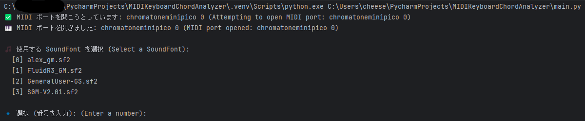
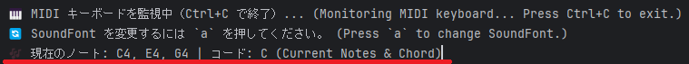

# MIDIKeyboardChordAnalyzer 🎹

**MIDI キーボードのリアルタイム入力を解析し、コードを表示するツール**

---

## 🎵 機能
- **MIDIキーボードのリアルタイム入力**
- **SoundFont (SF2) を自由に選択**
- **コード解析 & 表示**
  - 対応: 3和音、4和音、テンションコード、オルタードコード、分数コード 
- **リアルタイムで押しているキーの可視化**
- **`a` キーで SoundFont を簡単に変更**
---

## 🌍 Other Languages
- 🇯🇵 **[日本語 (Japanese)](README.md)**
- 🇺🇸 **[English](README_EN.md)**

---

## 🪟 動作はWindows11でのみ確認しております。

pyfluidsynthのライブラリを適所に置けば、その他OSでも稼働する可能性はありますが対応致しかねます。

fluidsynth.pyのより抜粋
```
# A function to find the FluidSynth library
# (mostly needed for Windows distributions of libfluidsynth supplied with QSynth)
    macOS X64:
    * 'fluidsynth' was loaded as /usr/local/opt/fluid-synth/lib/libfluidsynth.dylib.
    macOS ARM64:
    * 'fluidsynth' was loaded as /opt/homebrew/opt/fluid-synth/lib/libfluidsynth.dylib.
    Ubuntu X86:
    * 'fluidsynth' was loaded as libfluidsynth.so.3.
    Windows X86:
    * 'libfluidsynth-3' was loaded as C:\tools\fluidsynth\bin\libfluidsynth-3.dll.
```


## 📦 インストール方法
Python3 環境で、以下のコマンドを実行：

```sh
pip install -r requirements.txt
```

---
## 🔗 必要な外部ツール
このプログラムでは、以下のツールを使用します。事前にインストールしてください。

- **[FluidSynth](https://github.com/FluidSynth/fluidsynth/releases)**  
  MIDI シンセサイザーとして動作し、SoundFont (.sf2) ファイルを読み込んで音を鳴らします。

- **[SDL3](https://github.com/libsdl-org/SDL/releases)**  
  FluidSynth の一部機能を動作させるために必要なライブラリです。

### 1️⃣ **FluidSynth のダウンロードとインストール**
公式サイト [FluidSynth Releases](https://github.com/FluidSynth/fluidsynth/releases) より、  
`fluidsynth-<Version>-win10-x64.zip` をダウンロードし、解凍してください。

用いるpyfluidsynthモジュールの仕様上、必ず以下のディレクトリ構成として下さい。
"C:\tools\fluidsynth\bin"ディレクトリにて必要ファイル(libfluidsynth-3.dll)を探す仕様となっているため。

**解凍後のディレクトリ構成：**
```
C:\tools\fluidsynth\
              ├── bin\
              ├── include\
              ├── lib\
```

---

### 2️⃣  **SDL3.dll の配置**
FluidSynth 2.3 以降では `SDL3.dll` が必要です。

1. 公式サイト [SDL3 Releases](https://github.com/libsdl-org/SDL/releases) にアクセス  
2. 最新の **`SDL3-devel-xxxx-win64.zip`** をダウンロード  
3. ZIP を解凍し、 **`SDL3.dll`** を取得  
4. **`C:\tools\fluidsynth\bin\`** に配置（`libfluidsynth-3.dll` と同じフォルダ）

---

## 🎵 **SoundFont (SF2) の準備**
MIDI キーボードの音源として **SoundFont (.sf2)** を使用します。

1. `.sf2` ファイルを **`C:\tools\sf2\`** に配置  
2. プログラム実行時に **SF2 ファイルを選択** できます

### 一通り揃っている無料の SoundFont
- [Alex's gm soundfont](https://musical-artifacts.com/artifacts/1390)
- [FluidR3_GM](https://member.keymusician.com/Member/FluidR3_GM/index.html)
- [GeneralUser-GS](https://www.schristiancollins.com/generaluser.php)

---

## 🚀 **使い方**
1. MIDIキーボードを接続
2. プロジェクトのフォルダに移動：

```sh
cd MIDIKeyboardChordAnalyzer
```

3. スクリプトを実行：

```sh
python main.py
```

---

## **🎹 使用方法**

### **1️⃣ 使用する SF2 ファイルを選択**

- 起動後、使用する SoundFont (`.sf2`) を選択します。
- 番号を入力して選択し、Enter を押します。

---

### **2️⃣ 音源（プリセット）を選択**

- SF2ファイルの中から、使用する音色を選びます。
- 例えば **ピアノ, ギター, ストリングス** などの音源が選べます。

---

### **3️⃣ 準備完了！**

- 設定が完了すると、MIDI キーボードの入力を受け付ける状態になります。
- キーボードで演奏を始めましょう！

---

### **4️⃣ リアルタイムでコードを表示**

- MIDI キーボードで和音を弾くと、現在のコードがリアルタイムで表示されます。
- **コード解析機能** により、現在弾いているコードの種類を確認できます。

---

### **5️⃣ `a` キーで音源変更**

- `a` キーを押すと、**別の SoundFont（SF2）を選択** できます。
- **違う楽器の音色に切り替えながら演奏可能！**

---

## 🛠 **必要なライブラリ**
```txt
pyfluidsynth==1.3.4
python-rtmidi==1.5.8
keyboard==0.13.5
mido==1.3.3
```

---

## 🔧 **Tips（設定変更）**

### **🔊 音量調整**
`soundfont_manager.py` 内の `SYNTH_GAIN` を変更することで、音量を調整できます。

```python
SYNTH_GAIN = 1.0  # 例: 0.5（半分の音量）、2.0（倍の音量）
```

---

### **🎼 既存の SF2 ファイル・フォルダの設定変更**
デフォルトでは `C:/tools/sf2` に SoundFont ファイルを配置するようになっています。  
異なるパスを使用する場合は、`soundfont_manager.py` の `SF2_FOLDER` を変更してください。

```python
SF2_FOLDER = "C:/tools/sf2"  # 例: "D:/SoundFonts"
```

---

## 📄 **ライセンス**
MIT License
