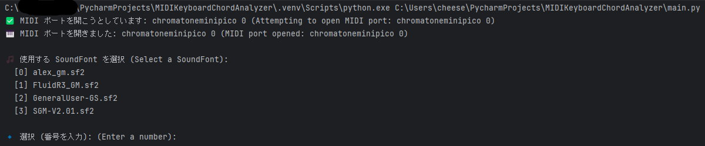
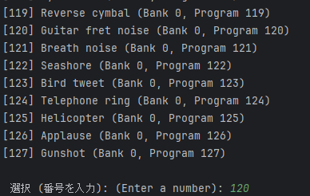
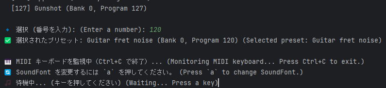
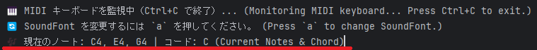
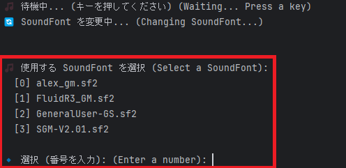

# MIDIKeyboardChordAnalyzer 🎹

**A tool for analyzing real-time MIDI keyboard input and displaying chord names**

---

## 🎵 Features
- **Real-time MIDI keyboard input**
- **Freely select SoundFont (SF2)**
- **Chord analysis & display** 
  - supports triads, seventh chords, tension chords, altered chords, and slash chords
- **Real-time visualization of pressed keys**
- **Easily switch SoundFonts with the `a` key**

---

## 🌍 Other Languages
- 🇯🇵 **[日本語 (Japanese)](README.md)**
- 🇺🇸 **[English](README_EN.md)**

---

## 🪟 Tested only on Windows 11.

While it may work on other operating systems by placing the `pyfluidsynth` library appropriately, support for other platforms is not provided.

Excerpt from `fluidsynth.py`:
```
# A function to find the FluidSynth library
# (mostly needed for Windows distributions of libfluidsynth supplied with QSynth)
    macOS X64:
    * 'fluidsynth' was loaded as /usr/local/opt/fluid-synth/lib/libfluidsynth.dylib.
    macOS ARM64:
    * 'fluidsynth' was loaded as /opt/homebrew/opt/fluid-synth/lib/libfluidsynth.dylib.
    Ubuntu X86:
    * 'fluidsynth' was loaded as libfluidsynth.so.3.
    Windows X86:
    * 'libfluidsynth-3' was loaded as C:\tools\fluidsynth\bin\libfluidsynth-3.dll.
```

---

## 📦 Installation
Run the following command in a Python 3 environment:

```sh
pip install -r requirements.txt
```

---

## 🔗 Required External Tools
This program requires the following tools. Please install them beforehand.

- **[FluidSynth](https://github.com/FluidSynth/fluidsynth/releases)**  
  A MIDI synthesizer that loads and plays SoundFont (.sf2) files.

- **[SDL3](https://github.com/libsdl-org/SDL/releases)**  
  Required for some features of FluidSynth.

### 1️⃣ **Downloading and Installing FluidSynth**
Download `fluidsynth-<Version>-win10-x64.zip` from the official [FluidSynth Releases](https://github.com/FluidSynth/fluidsynth/releases) page and extract it.

Due to the specifications of the `pyfluidsynth` module, it is essential to follow the directory structure below.  
This module looks for the required files (`libfluidsynth-3.dll`) in the `C:\tools\fluidsynth\bin` directory.

**Directory structure after extraction:**
```
C:\tools\fluidsynth\
              ├── bin\
              ├── include\
              ├── lib\
```

---

### 2️⃣ **Placing SDL3.dll**
FluidSynth 2.3 and later require `SDL3.dll`.

1. Visit the [SDL3 Releases](https://github.com/libsdl-org/SDL/releases) page.  
2. Download the latest **`SDL3-devel-xxxx-win64.zip`**.  
3. Extract the ZIP file and obtain **`SDL3.dll`**.  
4. Place **`SDL3.dll`** in **`C:\tools\fluidsynth\bin\`** (same folder as `libfluidsynth-3.dll`).

---

## 🎵 **Setting Up SoundFonts (SF2)**
SoundFonts (`.sf2` files) are used as the sound source for MIDI keyboards.

1. Place `.sf2` files in **`C:\tools\sf2\`**.  
2. You can select an SF2 file when running the program.

### Recommended Free SoundFonts
- [Alex's GM SoundFont](https://musical-artifacts.com/artifacts/1390)
- [FluidR3_GM](https://member.keymusician.com/Member/FluidR3_GM/index.html)
- [GeneralUser-GS](https://www.schristiancollins.com/generaluser.php)

---

## 🚀 **How to Use**
1. Connect a MIDI keyboard.
2. Navigate to the project folder:

```sh
cd MIDIKeyboardChordAnalyzer
```

3. Run the script:

```sh
python main.py
```

---

## **🎹 Usage Guide**

### **1️⃣ Select a SoundFont (SF2)**

- After launching, select the SoundFont (`.sf2`) to use.
- Enter a number and press Enter to select.

---

### **2️⃣ Select an Instrument Preset**

- Choose the instrument sound from the SF2 file.
- You can select instruments such as **piano, guitar, and strings**.

---

### **3️⃣ Ready to Play!**

- Once setup is complete, the program will start accepting MIDI keyboard input.
- Start playing!

---

### **4️⃣ Real-Time Chord Display**

- When you play chords on the MIDI keyboard, the current chord name is displayed in real-time.
- **The chord analysis feature** identifies the type of chord being played.

---

### **5️⃣ Switch SoundFonts with `a` Key**

- Press the `a` key to **select a different SoundFont (SF2)**.
- **Easily switch instrument sounds while playing!**

---

## 🛠 **Required Libraries**
```txt
pyfluidsynth==1.3.4
python-rtmidi==1.5.8
keyboard==0.13.5
mido==1.3.3
```

---

## 🔧 **Tips (Configuration Options)**

### **🔊 Adjusting Volume**
You can adjust the volume by modifying `SYNTH_GAIN` in `soundfont_manager.py`.

```python
SYNTH_GAIN = 1.0  # Example: 0.5 (half volume), 2.0 (double volume)
```

---

### **🎼 Changing SF2 Folder Path**
By default, the program uses `C:/tools/sf2` for SoundFont files.  
If you want to use a different path, modify `SF2_FOLDER` in `soundfont_manager.py`.

```python
SF2_FOLDER = "C:/tools/sf2"  # Example: "D:/SoundFonts"
```

---

## 📄 **License**
MIT License
